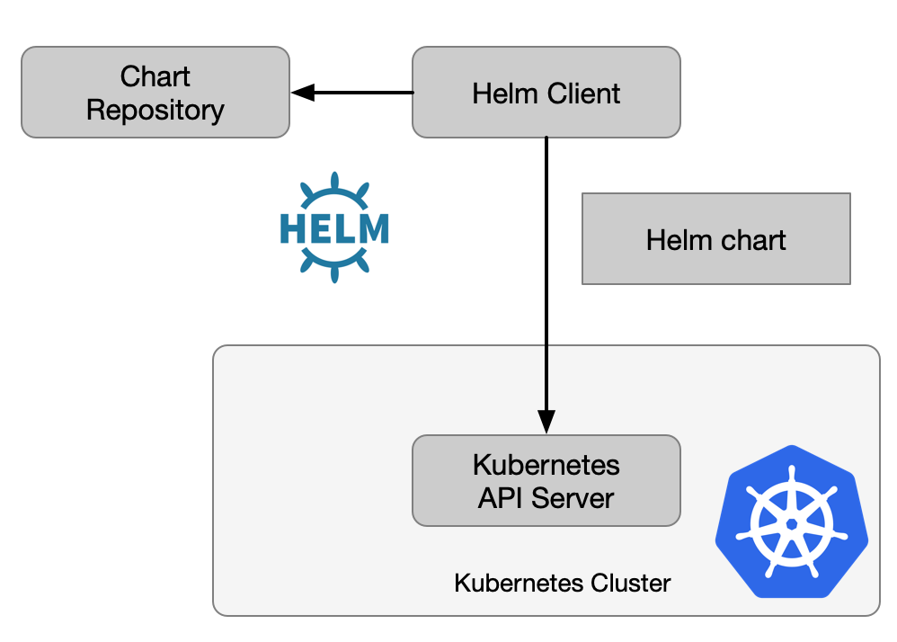

# Helm 简介

专为云原生软件构建可持续生态系统的云原生计算基金会于**2020年4月30日**宣布，Helm已经成为旗下第十个顺利毕业的项目。

Helm是一款软件包管理器，提供一种简单的方法以查找、共享并使用专为Kubernetes构建的软件成果。该项目采用一种名为图表（chart）的打包格式，用以描述一组彼此相关的Kubernetes资源文件集合。Helm项目已经在AT&T、Bitnami、CERN、Condé Nast、微软以及VMWare等企业当中得到生产级应用。

Helm项目于2015年由Deis创立，随后被微软收入囊中。同年11月，微软在KubeCon大会上第一次公布了现在为用户们所熟知的Helm经典产品。2016年，Helm团队与谷歌、Skippbox以及Bitnami联手开发了Helm 2，用于定义Helm chart创建、安装与管理的具体工作流程。2018年6月，Helm正式加入云原生计算基金会成为孵化项目。Helm Hub则于2018年末启动，成为Helm图表的集中存储平台，目前月均下载量高达数亿次。2019下半年，Helm团队又基于Helm 2工作流发布了Helm 3，新版本进一步调整了基础架构以反映社区变化与发展需求。

## 目标

做为Kubernetes的一个命令行包管理工具，用来管理Helm中定义的charts——预先配置好的安装包资源，有点类似于Ubuntu的APT和CentOS中的yum包管理工具。Helm具有如下功能：

- 从模板中创建新的chart
- chart打包成tgz格式
- 上传chart到chart仓库或从仓库中下载chart
- 在Kubernetes集群中安装或卸载chart
- 管理用Helm安装的chart的发布周期

Helm有三个重要概念：

- chart：包含了创建Kubernetes的一个应用实例的必要信息
- config：包含了应用发布配置信息
- release：由一个chart及其相应的config信息的运行的一次具体部署

由此，Helm实现了通过chart这样的概念定义，实现了对Kubernetes中一次应用发布的封装，同时实现了部署的版本管理，应用依赖的检查，便于应用程序的部署分发。下图来自IBM BLOG。

## 组件

Helm是一个可执行的二进制文件，其代码实现主要可以分为两部分：

Helm Client 是面向终端用户的命令行工具。客户端主要提供了如下功能：

- 本地的chart包开发
- 管理chart仓库
- 管理releases版本
- 和 Helm library 通信交互：发送将被安装的chart；请求升级或卸载已存在的release；

Helm Library则负责Helm 具体操作的逻辑实现。它主要和Kubernetes API server进行交互，并提供了如下能力：

- 将chart 和 config 信息结合匹配从而构建出一次具体的release
- 把chart 安装到Kubernetes，同时生成对应的release对象
- 和Kubernetes交互，升级、卸载对应的chart。

Helm library单独封装了Helm的具体逻辑，所以它可以被不同的客户端调用。Helm 的Client 和Library 都是通过Go语言编写。Library使用 Kubernetes client 库去和Kubernetes 进行通信，这个库使用REST+JSON，将信息数据存储在了Kubernetes的Secrets对象中，不需要单独的数据库。

