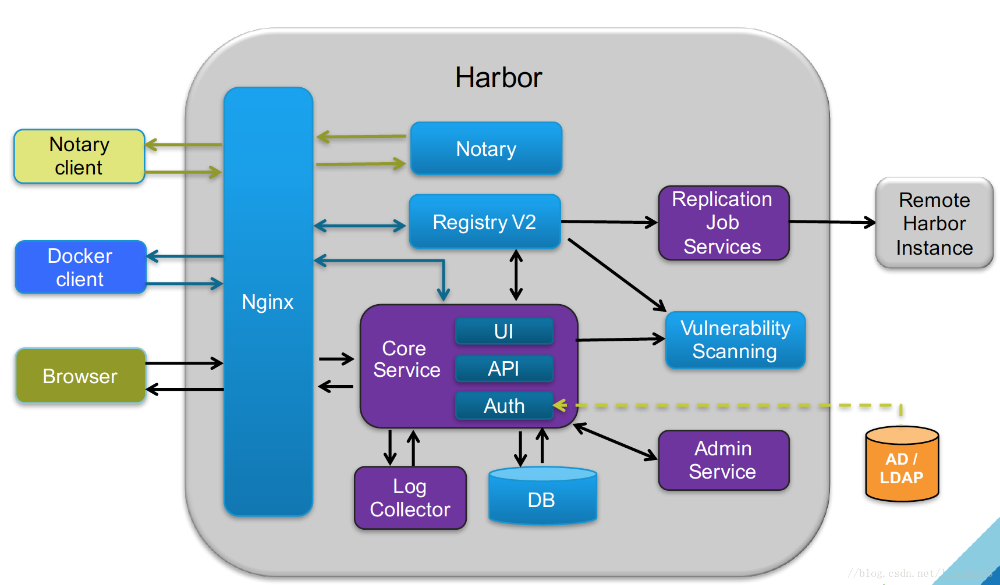
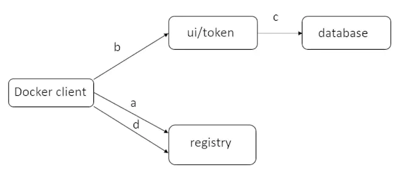

# Harbor 简介

Harbor 是一个开源制品（artifact）仓库，可通过策略和基于角色的访问控制来保护制品（如容器镜像、Helm Chart等），扫描镜像并避免受安全漏洞的危害，并对镜像签名成为受信内容，帮助用户在 Kubernetes 和 Docker 等云原生平台之中持续和安全地管理制品。

Harbor 源于 2014 年 VMware中国研发中心云原生实验室的一个内部项目，旨在为容器的开发人员解决镜像管理的问题。随着 Kubernetes 和容器技术的流行，该项目于 2016 年开源，并于 [2018 年 7 月捐赠给 CNCF](http://mp.weixin.qq.com/s?__biz=MzAwNzUyNzI5Mw==&mid=2730790774&idx=2&sn=6ff9eb88b8179fe0599f0cd0c9fb0e85&chksm=bc4ce1648b3b6872ce6301e638010c0bd07dc0a50e4b5460273053301f95d8fa94655f159523&scene=21#wechat_redirect)，在同年 11 月被正式接受为孵化项目。

2020年5月， [Harbor 2.0](http://mp.weixin.qq.com/s?__biz=MzAwNzUyNzI5Mw==&mid=2730791329&idx=2&sn=215e5d7ea817bd662a6fc91c5c0fd99f&chksm=bc4cffb38b3b76a5effcd89b04453fb041ddcd3ca7f560671049795450a35f91a03f48b7f20a&scene=21#wechat_redirect) 正式发布，增加了对 OCI 制品的支持，能够存储大量云原生制品，例如容器镜像、Helm Chart、CNAB、OPA 和 Singularity 等等。开发人员可依照 OCI 规范，通过 OCI 索引和 OCI 制品功能开拓更广泛的应用场景，包括策略、远程复制和基于角色的访问控制等。**2020 年 6 月 23 日** ，Harbor 成为第 11 个毕业的项目。这是首个中国原创项目自CNCF毕业。

## 特性

- **云原生镜像库**(Cloud native registry)
- **基于角色的访问控制**(Role Based Access Control)
- **基于策略的镜像复制**(Policy based image replication)
- **漏洞扫描**(Vulnerability Scanning)
- **LDAP/AD集成**(LDAP/AD support)
- **OIDC 支持**
- **镜像删除和垃圾清理**(Image deletion & garbage collection)
- **签名功能**
- **友好管理界面**(Graphical user portal)
- **审计**(Auditing)
- **RESTful API**
- **部署简单**(Easy deployment)

## 核心组件

1. Nginx（Proxy代理层）：Nginx前端代理，主要用于分发前端页面ui访问和镜像上传和下载流量; Harbor 的 registry , UI , token等服务，通过一个前置的反向代理统一接收浏览器、Docker客户端的请求，并将请求转发给后端不同的服务

2. Registry v2：镜像仓库，负责存储镜像文件; Docker官方镜像仓库, 负责储存Docker镜像，并处理docker push/pull命令。由于我们要对用户进行访问控制，即不同用户对Docker image有不同的读写权限，Registry会指向一个token服务，强制用户的每次docker pull/push请求都要携带一个合法的token, Registry会通过公钥对token进行解密验证

3. Database(MySQL或Postgresql)：为core services提供数据库服务，负责储存用户权限、审计日志、Docker image分组信息等数据

4. Core services(Admin Server)：这是Harbor的核心功能，主要提供以下服务：

   - UI：提供图形化界面，帮助用户管理registry上的镜像（image）, 并对用户进行授权

   - webhook：为了及时获取registry 上image状态变化的情况， 在Registry上配置webhook，把状态变化传递给UI模块
   - Auth服务：负责根据用户权限给每个docker push/pull命令签发token. Docker 客户端向Regiøstry服务发起的请求,如果不包含token，会被重定向到这里，获得token后再重新向Registry进行请求
   - API: 提供Harbor，RESTful API

5. Replication Job Service：提供多个 Harbor 实例之间的镜像同步功能.

6. Log collector：为了帮助监控Harbor运行，负责收集其他组件的log，供日后进行分析。

## 主要流程

### docker login

1. 首先请求被 proxy 容器监听的 80 端口接收，nginx 在这个容器中将请求转发到 Registry 容器中.
2. Registry 容器配置了基于 token 的权限认证，因此会返回一个 401 的状态码，提示 docker client 去指定的 url 获取一个有效的 token。在 harbor 中这个 url 指向了 Core Services 提供的 token service。
3. 当 docker client 接收到错误码，重新发送一个根据 Http 规范的基本认证并在 Header 中嵌入了用户名密码的请求.
4. 此请求通过转发 80 端口后，Nginx 根据预先配置的规则再次将该请求转发到 UI 容器， token service 在 UI 容器中接收请求，并获取用户名密码.
5. 获取用户名密码后，token service 进行权限认证（内部数据库/LDAP），若认证通过 则会在 HttpResponse 的 body 中返回一个由私钥生成的 token.

至此 docker login 流程结束 docker 会将用户名密码编码后存储到隐藏文件中

### docker push

1. 首先，docker client 类似 login 的流程请求 registry，返回一个 token service 的 Url。
2. 随后，当与 token service 联系时， docker client 提供附加额外的信息来获取该镜像（library/hello-world）push 操作的 token。
3. 接收到 nginx 转发的请求后，token service 去数据库查询该用户的是否由权限 push 该镜像。如果权限允许，将会对 push 操作的信息进行编码，并使用私钥进行签名，生成 token 返回给 docker client。
4. 最后，docker client 获取 token 后，发送 push 请求到 registry。Registry 收到请求后用公钥进行解码并验证其内容，如果 registry 发现 token 有效，则镜像开始传数步骤。

参考链接：

[Docker企业级私有仓库](https://caimengzhi.gitee.io/books/linux/server/harbor/harbor.index/)

[Harbor私有仓库配置与部署](https://blog.csdn.net/zhangjunli/article/details/107642592)